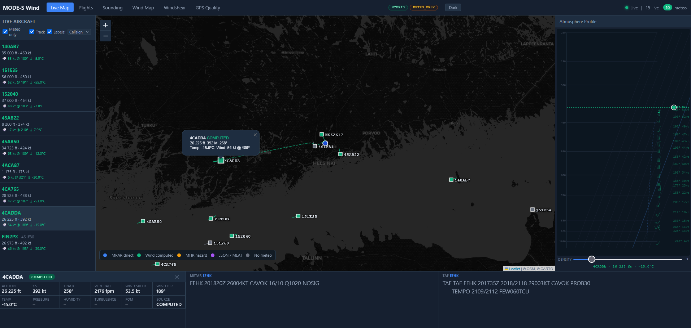

# MODE-S Wind

A Python-based system for collecting, decoding and visualising real-time meteorological data from aircraft using **MODE-S Enhanced Surveillance (EHS)** and **ADS-B** messages received by a [Jetvision Radarcape](https://www.jetvision.de/radarcape/) receiver.

Aircraft continuously broadcast meteorological data from their onboard sensors as part of their secondary surveillance transponder output. This system decodes those messages in real time, stores the data in a local SQLite database, and presents it through a dark-themed web dashboard with a live map, historical flight browser, Skew-T atmospheric sounding diagrams, and a gridded historical wind map.

> **⚠ Note for test users:** Due to heavy GPS jamming originating from the east, GPS-derived positions between approximately 3 000 ft and 1 000 ft are currently intermittently unreliable. Approaches to RWY 04L and 04R are particularly affected. Position data at these altitudes should be interpreted with caution.
>
> The current situation has worsened significantly since the beginning of May 2026. Previously, jamming was mostly limited to higher altitudes (8 000 – 10 000 ft) with little practical impact on approach traffic. The jamming is now effective down to much lower altitudes, directly affecting final approach segments.



---

## Features

- **Real-time live map** — ATC-style aircraft display with 1-minute position trails, colour-coded by meteo data source, with optional callsign or ICAO24 labels
- **Three meteo data sources** decoded simultaneously:
  - BDS 4,4 MRAR — Meteorological Routine Air Report (direct temp, pressure, humidity, wind, turbulence from aircraft avionics)
  - BDS 4,5 MHR — Meteorological Hazard Report (icing, wind shear, microburst, turbulence levels)
  - BDS 5,0 + 6,0 computed wind — wind vector derived from true track, ground speed, magnetic heading and airspeed
- **MLAT position support** — polls the Radarcape's JSON feed for multilateration-derived positions that remain accurate even when GPS jamming suppresses ADS-B position broadcasts
- **Skew-T atmospheric soundings** — per-flight vertical profiles for climbing/descending flights, accessible from the Sounding page or directly from the Flights browser
- **Mini atmosphere profile panel** — always-visible Skew-T profile in the live map sidebar; clicking any aircraft immediately loads its full historical wind and temperature profile from the database, then continues accumulating live updates on top. Profile persists across page navigation — navigating away and back restores the full picture instantly.
- **Historical flight browser** — searchable and paginated table of all recorded flights with meteo statistics, time-series charts, and a flight track map
- **Persistent UI preferences** — all toggles (Meteo only, Labels, label mode, wind history density) are remembered across browser sessions via localStorage
- **Configurable meteo source mode** — choose between EHS-only (pyModeS Beast decoding), JSON-only (Radarcape's own decoded values), or Hybrid priority; active mode shown as a read-only badge in the navbar on every page
- **Configurable storage mode** — store all observations or meteo-only to drastically reduce database size and SD-card write load; active mode shown in the navbar badge alongside source mode
- **Per-aircraft write throttle** — configurable minimum interval between successive database writes for the same aircraft, dramatically reducing write volume without meaningfully affecting sounding data quality
- **Gridded historical wind map** — select a flight level, altitude tolerance, time window (preset or custom historical range) and grid resolution; U/V-averaged wind barbs are plotted on a Leaflet map at each populated grid cell, colour-coded by wind speed
- **QNH pressure-altitude correction** — for wind map layers below FL050, the query band is automatically shifted into pressure-altitude space using the latest METAR QNH so that observations are binned to the correct MSL altitude. Raw pressure altitudes are kept intact in the database; correction is applied at query time only
- **Windshear approach monitoring page** — ATC-style real-time display of all aircraft established on ILS approach, with flight strips, an ILS glideslope vertical profile canvas, and an optional windshear detection algorithm; see [Windshear](#windshear--windshear) below
- **SQLite database** with WAL mode — safe for Raspberry Pi SD-card or USB SSD operation
- **HTTP Basic Auth** — simple credentials-based access control for local network deployment

---

## Hardware Requirements

| Component | Requirement |
|-----------|-------------|
| MODE-S receiver | Jetvision Radarcape (Beast binary TCP output on port 10003, JSON feed on port 80) |
| Computer | Raspberry Pi 4 (2 GB RAM or more recommended) or any Linux machine |
| Storage | SD card works; USB SSD strongly recommended for long-term database growth |
| Network | Receiver and Raspberry Pi on same local network |

The system was developed and tested with a Radarcape receiver and Raspberry Pi 4 near EFHK (Helsinki-Vantaa Airport, Finland). Any receiver that outputs Beast binary format over TCP will work, though the JSON/MLAT feed integration is specific to the Radarcape.

---

## Software Architecture

```
Radarcape receiver (192.168.0.119)
        │
        ├─ TCP :10003  Beast binary  ──► collector/receiver.py
        │                                      │  pyModeS decoding
        │                                      │  BDS 4,4 / 4,5 / 5,0 / 6,0
        │                                      │  CPR position decoding
        │                                      ▼
        └─ HTTP /aircraftlist.json ──► collector/radarcape_json.py
                                               │  MLAT positions
                                               │  Pre-decoded temp & wind
                                               ▼
                                     ┌─────────────────┐
                                     │  live_state dict │  (shared in-memory)
                                     └────────┬────────┘
                                              │
                             ┌────────────────┼──────────────────┐
                             │                │                  │
                       database/       windshear sweep     web/app.py
                       writer thread   daemon (3 s)        Flask + SSE
                       (SQLite WAL)         │               │
                             │       WindshearTracker       ├─ /           Live map
                             │       (RAM only, no DB)      ├─ /flights    History
                             │                              ├─ /sounding   Skew-T
                       data/modes_meteo.db                  ├─ /windmap    Wind map
                                                            └─ /windshear  Approach
```

### Data source priority

When multiple sources are available for the same observation the `best_*` consolidated fields are populated in this order of preference:

1. **MRAR** (BDS 4,4) — highest quality, direct avionics measurement with Figure of Merit
2. **MHR** (BDS 4,5) — secondary hazard report
3. **COMPUTED** — wind vector calculated from BDS 5,0 + 6,0 pair
4. **JSON** — temperature or wind injected from Radarcape's JSON feed

---

## Installation

### 1. Clone the repository

```bash
git clone https://github.com/oh2gax/mode_s_wind.git
cd mode_s_wind
```

### 2. Install Python dependencies

Python 3.10 or newer is required.

```bash
pip3 install flask pyModeS requests --break-system-packages
```

Or inside a virtual environment:

```bash
python3 -m venv venv
source venv/bin/activate
pip install flask pyModeS requests
```

> **Note:** The `pyModeS-main` folder in the repository is a reference copy of the pyModeS library by Junzi Sun. If you install `pyModeS` via pip you do not need to use this folder.

### 3. Configure the system

Edit `config.py` — all settings are in one place:

```python
class Config:
    # ── Radarcape connection ──────────────────────────────────────────────
    RADARCAPE_HOST = "192.168.0.119"   # change to your receiver's IP
    RADARCAPE_PORT = 10003             # Beast binary TCP port (Radarcape default)

    # ── Web interface ─────────────────────────────────────────────────────
    WEB_HOST = "0.0.0.0"
    WEB_PORT = 5010
    WEB_USER = "admin"                 # change before exposing to network
    WEB_PASS = "admin123"              # change before exposing to network

    # ── Database path ─────────────────────────────────────────────────────
    DB_PATH = "data/modes_meteo.db"    # relative to project root
    # For USB SSD: "/mnt/usb/modes_meteo.db"

    # ── Receiver location ─────────────────────────────────────────────────
    RECEIVER_LAT = 60.317              # decimal degrees N
    RECEIVER_LON = 24.963             # decimal degrees E

    # ── Magnetic declination ──────────────────────────────────────────────
    MAG_DECLINATION = 8.0             # degrees E (Finland 2025–2026 ≈ +8°)

    # ── Radarcape JSON / MLAT feed ────────────────────────────────────────
    RADARCAPE_JSON_URL = "http://192.168.0.119/aircraftlist.json"
    RADARCAPE_JSON_INTERVAL = 5.0     # poll interval in seconds

    # ── Sounding aggregation ──────────────────────────────────────────────
    SOUNDING_RADIUS_KM = 150.0        # aggregate obs within this radius
    SOUNDING_WINDOW_MIN = 60          # aggregate over this many past minutes

    # ── Meteo source mode ─────────────────────────────────────────────────
    METEO_SOURCE_MODE = "HYBRID"      # "EHS" | "JSON" | "HYBRID"

    # ── Storage mode ──────────────────────────────────────────────────────
    STORAGE_MODE = "ALL"              # "ALL" | "METEO_ONLY"

    # ── Airport ICAO ──────────────────────────────────────────────────────
    AIRPORT_ICAO = "EFHK"             # used for METAR/TAF display and QNH correction

    # ── Per-aircraft write throttle ───────────────────────────────────────
    WRITE_MIN_INTERVAL_SEC = 30.0     # 0 = disabled (store every observation)

    # ── Windshear / Approach monitoring ───────────────────────────────────
    WINDSHEAR_AIRPORT_LAT = 60.3172   # airport reference point (lat)
    WINDSHEAR_AIRPORT_LON = 24.9634   # airport reference point (lon)
    WINDSHEAR_RADIUS_NM = 15.0        # outer tracking radius (NM)
    WINDSHEAR_MAX_ALT_FT = 5000.0     # altitude gate (ft) — ignore aircraft above
    WINDSHEAR_CORRIDOR_HALF_WIDTH_NM = 1.5   # ILS corridor half-width (NM)
    WINDSHEAR_MAX_ILS_NM = 25.0       # max along-track range from threshold
    WINDSHEAR_THR_ELEVATION_FT = 179.0        # runway threshold elevation MSL (ft)
    WINDSHEAR_GS_OFFSET_FT = 0.0      # manual glideslope calibration trim (ft)
    WINDSHEAR_MAX_TRACK_DEV_DEG = 60.0        # max track deviation from approach hdg (°)
```

Key values to change for your installation:

- `RADARCAPE_HOST` — IP address of your Radarcape on the local network
- `RECEIVER_LAT` / `RECEIVER_LON` — your receiver's location (used for CPR position decoding and sounding radius)
- `MAG_DECLINATION` — magnetic declination for your location (affects computed wind accuracy); find your value at [NOAA magnetic declination calculator](https://www.ngdc.noaa.gov/geomag/calculators/magcalc.shtml)
- `AIRPORT_ICAO` — ICAO code of your nearest airport (used for METAR/TAF display on the Live Map bottom strip and as the QNH source for Wind Map low-altitude corrections)
- `WEB_USER` / `WEB_PASS` — credentials for the web interface
- `METEO_SOURCE_MODE`, `STORAGE_MODE`, and `WRITE_MIN_INTERVAL_SEC` — see the [Operational Modes](#operational-modes) section below
- `WINDSHEAR_AIRPORT_LAT` / `WINDSHEAR_AIRPORT_LON` — reference point for the 15 NM outer tracking circle on the Windshear page (set to your monitoring airport coordinates)
- `WINDSHEAR_THR_ELEVATION_FT` — runway threshold elevation above MSL in feet; used to anchor the 3° glideslope correctly on the ILS vertical profile (EFHK = 179 ft)
- `WINDSHEAR_GS_OFFSET_FT` — manual calibration trim for the glideslope line; adjust if aircraft you know to be on glideslope still appear consistently high or low after the threshold and QNH corrections are applied
- `WINDSHEAR_MAX_TRACK_DEV_DEG` — maximum allowed deviation in degrees between an aircraft's ADS-B ground track and the runway's approach heading; the default of 60° rejects departures on parallel runways (which fly ~180° off the approach heading) while accepting all legitimate approach aircraft including those still rolling out of a late vector intercept

### 4. Run

```bash
python3 run.py
```

The system will log startup information and the web interface address:

```
2025-05-11 12:00:00  INFO     modes.main           ============================================================
2025-05-11 12:00:00  INFO     modes.main           MODE-S Wind System starting
2025-05-11 12:00:00  INFO     modes.main             Database    : /home/pi/mode_s_wind/data/modes_meteo.db
2025-05-11 12:00:00  INFO     modes.main             Radarcape   : 192.168.0.119:10003
2025-05-11 12:00:00  INFO     modes.main             Web         : http://0.0.0.0:5010
2025-05-11 12:00:00  INFO     modes.main             Source mode : HYBRID
2025-05-11 12:00:00  INFO     modes.main             Storage mode: ALL
```

Open `http://<raspberry-pi-ip>:5010` in a browser. You will be prompted for username and password.

### 5. Running in the background (optional)

```bash
nohup python3 run.py > logs/modes_wind.log 2>&1 &
echo $! > run.pid          # save PID to stop later
```

To stop:

```bash
kill $(cat run.pid)
```

### 6. Run as a systemd service (recommended for permanent deployment)

Create `/etc/systemd/system/modes-wind.service`:

```ini
[Unit]
Description=MODE-S Wind System
After=network.target

[Service]
Type=simple
User=pi
WorkingDirectory=/home/pi/mode_s_wind
ExecStart=/usr/bin/python3 run.py
Restart=on-failure
RestartSec=10

[Install]
WantedBy=multi-user.target
```

Enable and start:

```bash
sudo systemctl daemon-reload
sudo systemctl enable modes-wind
sudo systemctl start modes-wind
sudo systemctl status modes-wind
```

---

## Operational Modes

Two independent settings in `config.py` control how the system collects and stores data. Both are displayed as read-only pill badges in the navbar on every page of the web interface so you always know which modes are active without opening any files.

Changing either setting requires editing `config.py` and restarting the service. The active configuration is also printed in the startup log.

---

### Meteo Source Mode (`METEO_SOURCE_MODE`)

Controls which data source provides the meteorological values (wind speed/direction, temperature, pressure) that appear in the live map, sounding diagrams, and database.

| Value | Behaviour |
|-------|-----------|
| `"HYBRID"` | **Default.** EHS data from the Beast feed has priority. The Radarcape JSON feed provides MLAT positions and fills in meteo values only for aircraft where pyModeS has not yet produced any EHS data. This preserves the full decode chain while also capturing aircraft that are only reachable via MLAT. |
| `"EHS"` | The JSON feed is used exclusively for MLAT positions. It never injects meteo values. All wind, temperature and pressure data comes from pyModeS decoding of BDS 4,4 / 4,5 / 5,0 / 6,0 registers received via the Beast TCP feed. Use this mode to work with fully transparent, self-decoded data. |
| `"JSON"` | The Radarcape's own decoded wind and temperature values from `aircraftlist.json` are always used and overwrite any EHS-derived values for the same aircraft on every poll cycle. Use this to compare the Radarcape's internal processing against the pyModeS decode chain, or to rely on the receiver hardware's own algorithms. |

**Tip:** If you are seeing mostly `COMPUTED` source tags (green symbols on the map), EHS decoding is working well. Switch to `"EHS"` mode to confirm that the JSON feed is not contributing anything and that all meteo originates from pyModeS. Switch to `"JSON"` mode to see what the Radarcape produces on its own and compare values.

---

### Storage Mode (`STORAGE_MODE`)

Controls which decoded observations are written to the SQLite database.

| Value | Behaviour |
|-------|-----------|
| `"METEO_ONLY"` | **Default.** Only observations that carry at least one decoded meteo value (`meteo_source ≠ NONE`) are written to disk. Position-only messages are used to update the live map in memory but are never persisted. This typically reduces database growth by 60–80% depending on what fraction of tracked aircraft are producing meteo data. Recommended for long-running deployments on SD card or when storage is limited. |
| `"ALL"` | Every decoded observation is stored — positions, motion data, and meteo — regardless of whether it carries any meteorological values. This gives the most complete flight tracks and motion history but grows the database quickly. At a busy location like EFHK, the database can accumulate several hundred megabytes per day. |

**Note:** In `METEO_ONLY` mode the `flights` table still records every flight session, but individual `observations` rows exist only for moments when meteo data was present. Flight track maps in the Flights browser will show only the positions where meteo was decoded rather than the full continuous path.

**SD card recommendation:** Even with `METEO_ONLY`, SQLite WAL mode generates frequent small writes which accelerate SD card wear. Moving the database to a USB SSD (update `DB_PATH` in `config.py`) is strongly recommended for any deployment intended to run continuously for more than a few days.

---

### Write Throttle (`WRITE_MIN_INTERVAL_SEC`)

Controls the minimum time gap (in seconds) between successive database writes for the same aircraft. This is the most effective single setting for controlling database growth during extended operation.

| Value | Behaviour |
|-------|-----------|
| `30.0` | **Default.** At most one observation stored per aircraft per 30 seconds. An aircraft cruising at FL350 for 20 minutes produces ~40 rows instead of potentially hundreds. During climbs and descents a typical jet ascends ~1 000 ft per 30-second interval, so consecutive stored observations naturally sample different altitude layers — sounding profile quality is essentially unaffected. |
| `60.0` | One observation per minute per aircraft. Halves the write volume again compared to 30 s. Suitable for very long-running deployments or slower storage media. Sounding resolution remains good since standard pressure levels are typically 1 000–2 000 ft apart. |
| `0` | Throttle disabled — every qualifying observation is stored immediately. Use only for short diagnostic sessions or when studying individual message rates. |

**Combined effect:** Running `METEO_ONLY` together with `WRITE_MIN_INTERVAL_SEC = 30.0` is the recommended configuration for continuous long-term operation. At a busy location like EFHK, testing has shown this reduces database growth from several hundred MB per hour (all observations, no throttle) to a much more manageable level while preserving all the data needed for sounding profiles and historical analysis.

**Tuning guide:**

- Start with `30.0` and monitor database growth over a few hours of peak traffic.
- If growth is still too fast, increase to `60.0`.
- If you need finer vertical resolution in sounding profiles (e.g. studying temperature inversions in thin layers), reduce toward `10.0`–`15.0`.
- Set to `0` temporarily if you want to capture a specific event at full resolution, then restore your normal value.

---

## Web Interface

### Status indicator

The top navigation bar always shows the connection status:

- 🟢 **Live** — SSE stream active (Live page only)
- 🟢 **Online** — web API responding (Flights and Sounding pages)
- 🔴 **Reconnecting…** — connection lost, retrying automatically

The navbar also shows live aircraft counts: total aircraft visible and how many are currently providing meteo data.

---

### Live Map  `/`

The main dashboard showing all currently tracked aircraft in real time, updated every 3 seconds via Server-Sent Events.

#### Aircraft symbols

Aircraft are drawn in an ATC-style display:

- **Filled square** — current position of the aircraft
- **Speed vector line** — short line extending from the square in the direction of travel (track)
- **Colour** — indicates the meteo data source:

| Colour | Source | Description |
|--------|--------|-------------|
| 🔵 Blue | MRAR | BDS 4,4 Meteorological Routine Air Report — direct avionics data |
| 🟢 Green | COMPUTED | Wind calculated from BDS 5,0 + BDS 6,0 pair |
| 🟡 Amber | MHR | BDS 4,5 Meteorological Hazard Report |
| 🟣 Purple | JSON | Temperature/wind from Radarcape JSON feed (MLAT source) |
| ⚫ Grey | NONE | Aircraft visible but no meteo data decoded yet |

#### Trail dots

Each aircraft leaves a trail of fading dots showing its position over the past ~60 seconds. Older positions are more transparent; the trail gives an immediate sense of direction and speed without cluttering the map.

#### Left panel — Aircraft list

Lists all currently visible aircraft sorted alphabetically. Shows callsign, ICAO24 code, altitude, ground speed, and the current wind/temperature reading if available. Click any row to select that aircraft and open the detail strip.

**Meteo only** checkbox — hides all aircraft that do not currently have any decoded meteo data. Defaults **on**; state persists across browser sessions.

#### Map labels

**Labels checkbox** — toggles callsign or ICAO24 labels next to each aircraft symbol on the map. Defaults **on**; state persists across browser sessions.

**Label mode selector** — choose between:
- **Callsign** — shows the flight's callsign (e.g. FIN3GJ). Once a callsign has been seen for an aircraft it is cached and will never revert to the ICAO24 code even if some subsequent messages do not include it.
- **ICAO24** — always shows the aircraft's ICAO 24-bit address (e.g. 461F52).

The selected label mode persists across browser sessions.

**Track checkbox** — when enabled, selecting an aircraft draws a dashed polyline on the map showing its recorded flight path, built from the latitude/longitude coordinates stored alongside each meteo observation in the database. The polyline is drawn in the aircraft's meteo-source colour and updates automatically each time the DB history is refreshed. The Track setting defaults **off** and persists across browser sessions via localStorage. The polyline is removed when the aircraft is deselected or the Track checkbox is turned off.

#### Bottom strip — METAR / TAF

The bottom of the live map always shows the current METAR and TAF for the configured airport (`AIRPORT_ICAO` in `config.py`, default EFHK). The data is fetched server-side from NOAA and refreshed automatically every 10 minutes. METAR and TAF are displayed side-by-side in a fixed-position panel anchored to the right; selecting an aircraft does not shift or disturb this panel.

#### Clicking an aircraft

Clicking an aircraft symbol or list entry:

1. **Enlarges the symbol** on the map for easy tracking
2. **Opens the aircraft detail panel** on the left side of the bottom strip showing all decoded values:
   - Altitude, ground speed, track, vertical rate (shown in **fpm**)
   - Wind speed and direction
   - Temperature, pressure, humidity
   - Turbulence level and Figure of Merit (FOM) if from MRAR
   - Meteo source badge
3. **Overlays the aircraft's full wind profile** on the Atmosphere Profile panel (right side) — see below

Click the **✕** button to deselect and close the aircraft detail panel. The METAR/TAF panel remains visible at all times.

#### Right panel — Atmosphere Profile

A permanently visible Skew-T Log-P diagram filling the full height of the right panel. The canvas automatically sizes itself to the available space when the page loads and reflows whenever the browser window is resized, giving maximum vertical resolution for the profile. The diagram uses a log-pressure Y axis and a skewed temperature X axis, with the ISA (International Standard Atmosphere) reference temperature shown as a dashed blue line.

**When no aircraft is selected** the diagram shows only the ISA reference grid and a "Click an aircraft to show profile" hint.

**When an aircraft is selected** the panel immediately loads the aircraft's full flight history from the database, then continues accumulating live updates:

- **Wind barbs** — drawn in the aircraft's colour for each stored altitude observation, labelled with direction and speed in the format **248° 24kt** (FROM direction, meteorological convention). Older history barbs are shown at 40% opacity.
- **Temperature dots** — plotted at the correct skewed-temperature position for each altitude observation.
- **Level indicator** — a dashed horizontal line showing the aircraft's current pressure level derived from barometric altitude via the ISA model. When temperature data is available a white-ringed coloured dot marks the point on the temperature curve; otherwise a small diamond appears on the pressure axis.

**Profile persistence** — the profile is pre-loaded from the database the first time you click an aircraft during a page session. Navigating to another page and returning, then clicking the same aircraft again, restores the complete historical profile instantly from the database rather than starting from scratch.

**Wind history density slider** — controls how densely history barbs are drawn. Each step equals a 400 ft minimum altitude gap between consecutive barbs:
- Position **1** (leftmost) — show a barb for nearly every 400 ft increment (dense, full detail)
- Position **8** (rightmost) — show barbs only every 3 200 ft (coarse, avoids overlap at high sample rates)
- Default is **2** (800 ft gap). The setting persists across browser sessions.

---

### Flights  `/flights`

Historical browser for all flights recorded in the database.

#### Filter bar

- **ICAO** — filter by ICAO24 address (partial match, e.g. `461F`)
- **Callsign** — filter by callsign (partial match, e.g. `FIN`)
- **Meteo only** — show only flights that have at least one meteo observation
- **Search** / **Reset** buttons
- Result count shown on the right

#### Flights table

| Column | Description |
|--------|-------------|
| ICAO | ICAO24 hex address |
| Callsign | Flight callsign if decoded |
| First seen (UTC) | Time the flight was first contacted |
| Last seen (UTC) | Time of last contact |
| Max alt | Highest altitude observed (ft) |
| Min alt | Lowest altitude observed (ft) |
| Obs | Total number of raw observations stored |
| Meteo obs | Number of observations with meteo data (highlighted if > 0) |
| Sounding | 🌡 Sounding button appears if the flight has meteo data AND an altitude range > 5 000 ft (suitable for a vertical profile) |

Flights are sorted newest first. Pagination at the bottom, up to 50 flights per page.

#### Flight detail modal

Clicking a flight row opens a modal showing:

- **Flight track map** — the aircraft's recorded path, with meteo observation points colour-coded by source (blue = MRAR, green = COMPUTED, amber = MHR)
- **Four time-series charts** — altitude, temperature, wind speed, wind direction over the flight duration
- **Observation table** — all meteo observations for the flight with UTC time, altitude, ground speed, source badge, wind, temperature, and pressure

#### Sounding link

The 🌡 **Sounding** button (visible on flights with sufficient altitude range) opens the Sounding page pre-loaded with that flight's vertical profile.

---

### Sounding  `/sounding`

Skew-T style atmospheric sounding for individual flights. Observations from a single flight are binned into 2 000 ft altitude bands to build a vertical profile. This works best for climbing departures or descending arrivals where the aircraft samples many different altitude layers.

Select a flight from the dropdown (populated with all flights that have meteo data and an altitude range > 5 000 ft, most recent first), then click **Load Sounding**.

The flight info banner below the controls shows callsign, ICAO24, time range, altitude range, and observation count.

You can also reach a specific flight's sounding directly from the Flights page via the 🌡 Sounding button, which opens this page with that flight pre-selected.

#### Skew-T diagram

The diagram shows:

- **Red line** — temperature profile (°C)
- **Wind barbs** on the right axis — wind speed and direction at each level (full barb = 10 kt, half barb = 5 kt, pennant = 50 kt)
- Standard pressure levels labelled on the left axis

#### Level data table

The table on the right shows each pressure level with:

| Column | Description |
|--------|-------------|
| Press (hPa) | Pressure level |
| Alt (ft) | Mean altitude of observations at this level |
| Temp (°C) | Mean temperature |
| Wind (kt) | Mean wind speed |
| Dir (°) | Mean wind direction (FROM, meteorological convention) |
| Obs | Number of observations contributing to this level |

---

### Wind Map  `/windmap`

A gridded horizontal wind analysis map built from historical observations stored in the database. Wind vectors within each grid cell are averaged using proper U/V component decomposition — the same mathematically correct method used by the sounding aggregation — so directional accuracy is preserved when combining multiple observations.

#### Controls

| Control | Options | Description |
|---------|---------|-------------|
| FL | 1 000 ft – 4 000 ft, FL050 – FL450 | Centre altitude for the filter. Low-altitude options (1 000–4 000 ft) are displayed in feet and sit below the transition altitude; FL050 and above use standard flight-level notation |
| ± | 500 / 1 000 / 2 000 / 3 000 ft | Altitude band around the chosen level; observations within ± tolerance are included. For the 1 000 ft layer a ±500 ft tolerance is recommended to keep the band tight |
| Period | Last 1 h / 3 h / 6 h / 12 h / 24 h / Custom | Time window for the database query. **Custom** reveals date+time pickers for selecting any historical hour from the database |
| Grid | 0.25° / 0.5° / 1.0° | Grid cell size in decimal degrees. Finer grids place barbs more precisely along flight routes; coarser grids merge nearby observations and produce a cleaner overview |
| Load | — | Executes the query and renders the map |

The status bar below the controls shows the number of raw observations used, the resulting cell count, the exact UTC time period, and the active grid resolution. For low-altitude layers (below FL050) the status bar additionally shows the QNH value that was used and the resulting pressure-altitude correction — for example `· QNH 998.0 hPa (alt corr +410 ft)`.

#### Wind barbs

Each populated grid cell is represented by a standard meteorological wind barb placed at the cell centre:

- **Staff** — points FROM the direction the wind is coming from (meteorological convention)
- **Pennant** — filled triangle = 50 kt
- **Full barb** — line = 10 kt
- **Half barb** — short line = 5 kt
- **Calm** — open circle when averaged speed rounds to 0 kt

**Colour** indicates averaged wind speed: green < 15 kt, blue 15–30 kt, amber 30–50 kt, red > 50 kt.

The label below each barb shows direction, speed, temperature (if available), and observation count — for example `248° 45kt −35.1°C (12)`. Clicking a barb opens a popup with full cell details including exact grid coordinates. Hovering shows a compact tooltip.

#### Interpreting the map

Observations will be concentrated along the main flight routes visible from your receiver — typically approach/departure corridors and overfly routes. Areas with no aircraft traffic will have no barbs. A longer time window and wider altitude tolerance populate more cells but may mix observations from different weather systems; a shorter window gives a snapshot closer to current conditions.

For best results when studying a specific weather event, use the Custom period selector to load exactly the hour of interest from your historical database.

---

### Windshear  `/windshear`

A dedicated real-time approach monitoring page for tracking aircraft established on ILS final approach. All tracking data is held entirely in RAM — the Windshear page does not write to the database and has no dependency on historical stored data.


#### Layout

The page has four main areas:

- **Left panel** — QNH display and ATC-style flight strips for aircraft inside the ILS corridor; strips extend the full height of the screen to maximise capacity during busy arrival sequences; strips are filtered to match the runway selected in the ILS profile selector
- **Right top** — Leaflet map with ILS centreline overlays, 15 NM range circle, and aircraft markers; the `Windrose` button overlays the Wind Rose panel in the top-right corner of the map
- **Bottom left** — ILS vertical glideslope profile canvas covering 0–15 NM from threshold, with an optional wind barb overlay selectable per aircraft
- **Bottom right** — Windshear event log with inline detection toggle, algorithm dropdown, and Clear button in the header
- **METAR / TAF strip** — aligned under the map and ILS profile only (right column); does not overlap the flight strips panel

#### ILS corridor detection

Aircraft are accepted into the display using precise geometric corridor matching combined with a track heading check. For each of the configured runway ILS centrelines, the system computes:

- **Cross-track offset** — perpendicular distance from the extended ILS centreline (signed: positive = right of centreline, negative = left)
- **Along-track distance** — projection along the centreline from the runway threshold (positive = aircraft is approaching, not yet at threshold)

An aircraft matches a runway only when all three conditions hold:

```
|cross-track offset| ≤ WINDSHEAR_CORRIDOR_HALF_WIDTH_NM       (default 1.5 NM)
0 ≤ along-track distance ≤ WINDSHEAR_MAX_ILS_NM                (default 25 NM)
|track − approach_heading| ≤ WINDSHEAR_MAX_TRACK_DEV_DEG       (default 60°, when track available)
```

The along-track gate excludes aircraft that have already passed through the threshold (negative along-track), such as aircraft that have landed and are rolling out. The track heading gate is the primary defence against **parallel-runway departures**: at EFHK, the two parallel runway pairs (04L/22R and 04R/22L) are only about 0.9 NM apart — well within the cross-track corridor — so a departure on 22L flying ~220° would otherwise pass the geometric gates for the 04L corridor (approaching its threshold from the north). The 60° track tolerance rejects it immediately since 220° is ~173° from the 04L approach heading of 047°. The same logic applies to all configured runways automatically.

The track check is skipped when track data is not available for an aircraft (rare at low altitude); those aircraft fall back to geometry-only matching, which is the same behaviour as before the check was added.

For airports with parallel runways (EFHK has 04L/04R and 22L/22R), the correct runway is identified by the sign of the cross-track offset: positive → right-hand runway (04R, 22R), negative → left-hand runway (04L, 22L).

**Entry state gate** — an additional filter rejects departing aircraft that briefly pass all the geometric gates near the threshold. Any aircraft that enters the tracker for the first time while climbing faster than +200 fpm is silently discarded. Existing tracked aircraft are fully exempt from this check: a go-around aircraft begins climbing while already present in the tracker, so the gate never interferes with legitimate missed-approach detection.

Aircraft that are within the outer radius and altitude limits but outside any ILS corridor remain visible on the map (shown dimmed) but do not appear in the flight strips.

#### Flight strips

Each aircraft inside an ILS corridor gets an ATC-style flight strip in the left panel, sorted by distance from threshold (closest first). The runway selector above the ILS profile canvas also filters the strips — selecting RWY 04L shows only 04L strips; selecting 04L & 04R shows both parallel approaches simultaneously.

The strip layout is fixed — every row is always rendered so the strip never shifts in height as data arrives:

- **Row 1** — Runway designator · vertical rate (fpm) · glideslope badge · squawk badge · WS badge
- **Row 2** — Callsign · **2nd APP / Nx APP** return-approach badge · aircraft type (all always shown; `—` when unknown)
- **Row 3** — Registration · ICAO24 hex code (both always shown)
- **Data grid** — two-column grid with labelled fields:

| Field | Description |
|-------|-------------|
| **RWY** | Large runway designator (04L, 22R, 15, etc.) |
| **↕ fpm** | Vertical rate — arrow up/down, colour-coded |
| **GS badge** | ON (green) / HIGH (amber) / LOW (red) / FAR (grey) — position relative to the 3° glideslope, computed client-side with full QNH correction applied (same correction as the ILS canvas) so strip badges always agree with the profile canvas |
| **Squawk badge** | SSR Mode-A transponder code decoded from Mode-S replies; grey pill for normal codes, red pill for emergency codes (7500 HIJACK, 7600 NORDO, 7700 MAYDAY) |
| **WS badge** | Pulsing amber/red badge when inside a detected windshear layer (visible only when detection is enabled) |
| **Alt** | Pressure altitude (ft) |
| **Dist** | Distance from runway threshold (NM) |
| **Wind** | Wind direction / speed decoded from EHS or JSON |
| **HW** | Headwind component along the runway heading (positive = headwind, negative = tailwind) |
| **Temp** | Temperature (°C) |
| **GS** | Groundspeed (kt) |
| **IAS** | Indicated Airspeed (kt) decoded from BDS 6,0 — shown when available, `—` otherwise |
| **XT** | Cross-track offset from centreline (NM) |

**Emergency squawk alarm** — when any tracked aircraft squawks 7500 (hijacking), 7600 (radio failure / NORDO), or 7700 (general emergency), a blinking red alarm banner appears at the top of the page, a ⚠ flash label blinks on the corresponding flight strip, and the squawk badge turns red. The alarm clears automatically if the code is no longer received. All tracked aircraft are scanned for emergency codes, not only those inside the ILS corridor.

Callsign stability — once a callsign has been decoded from either the ADS-B identification message (Beast feed) or the Radarcape JSON `fli` field, it is cached in the tracker and will never revert to the ICAO24 code even if some subsequent sweep cycles arrive without a callsign value.

#### ILS vertical profile

The canvas on the bottom left plots all corridor aircraft on a distance-vs-altitude graph:

- **X axis** — distance from threshold (0 NM at right = threshold, up to 15 NM at left)
- **Y axis** — pressure altitude (ft)
- **Dashed blue line** — 3° ILS glideslope reference, correctly positioned in pressure-altitude space
- **Blue shaded band** — ±300 ft glideslope tolerance zone
- **Coloured dots** — each aircraft, coloured by glideslope status (green = ON, amber = HIGH, red = LOW, grey = FAR)
- **History trails** — faint white line showing the aircraft's path over the past 10 minutes
- **Near-ground stale indicator** — when an aircraft is below 1 000 ft and no data has been received for more than 10 seconds (signal likely lost on short final), its dot fades to a dimmed blue and the label is removed. The dot remains at its last known position until the tracker removes it after the normal 30–45 second timeout
- **Labels** — callsign and current deviation from glideslope in feet (e.g. `FIN3GJ (+85ft)`)
- **Windshear zones** — amber/red horizontal bands between the altitudes of the two aircraft involved in a detected shear event (visible when detection is enabled)

The glideslope line accounts for two corrections applied at render time so that aircraft on the correct slope land exactly on the line:

1. **Threshold elevation** — the glideslope starts at the runway threshold altitude above MSL (configurable via `WINDSHEAR_THR_ELEVATION_FT`; EFHK ≈ 179 ft), not at sea level
2. **QNH correction** — MODE-S transponders always broadcast pressure altitude (1013.25 hPa reference). The glideslope reference is shifted by `(1013.25 − QNH) × 27 ft` to convert between pressure altitude and geometric altitude. At a QNH of 1000 hPa, this correction is approximately +357 ft. The current QNH is sourced from the live METAR and applied automatically; when QNH changes (polled every 10 minutes) the canvas redraws immediately.

The small annotation at the top-right of the canvas shows the active corrections so you can verify they are being applied — for example: `GS ref: thr+179ft  QNH+223ft  trim+0ft`.

A **manual trim** (`WINDSHEAR_GS_OFFSET_FT`) is also available for residual calibration errors such as slightly inaccurate threshold coordinates. Positive values shift the line up; negative shift it down.

#### Runway selector

The dropdown above the ILS profile header lets you filter by runway. It acts simultaneously as both a profile filter (only the selected runway's aircraft are drawn on the canvas) and a strip filter (only matching strips appear in the left panel).

Available options: **All runways**, **04L & 04R** (both parallel approaches together), **22L & 22R**, and each runway individually (04L, 04R, 22L, 22R, 15). The paired options are useful during dual-runway operations at EFHK where both parallel runways are in use simultaneously.

#### Wind barb overlay

The **🌬 Barbs** button, located in the ILS profile header immediately to the right of the runway selector, enables a wind barb layer drawn directly on top of the ILS glideslope canvas. The feature is fully RAM-based — data accumulates while the page is open and is lost when you navigate away, consistent with the rest of the Windshear page.

**Enabling the layer:** click the Barbs button to toggle it on (it turns cyan). While active, the system quietly accumulates wind observations for every aircraft inside the ILS corridor: one observation point is stored whenever an aircraft has descended at least 400 ft or moved at least 0.5 NM along the approach track since the previous stored point. Up to 40 observations are kept per aircraft, which is enough to cover a complete approach from 15 NM to threshold with good altitude resolution.

**Selecting an aircraft manually:** with Barbs enabled, click any flight strip in the left panel. The selected strip gains a cyan left border and the ILS canvas immediately draws that aircraft's accumulated wind barb history on top of the glideslope profile. Each barb is drawn at the exact (distance from threshold, pressure altitude) position where it was recorded. A small `dir°/spdkt` label appears above each barb showing the decoded wind direction and speed, and the aircraft callsign with total observation count is shown in the top-left corner of the canvas. Clicking the same strip again deselects it and clears the overlay.

**Auto barb mode:** the `Auto` segment attached to the Barbs button enables fully automatic aircraft selection. When active, the system selects the aircraft that is furthest along the approach (smallest distance from threshold — i.e. closest to the runway) and holds that selection until the aircraft goes stale and is removed from the display. At that point the next lowest aircraft is selected automatically, ensuring barbs are always visible as long as there is any approach traffic. The canvas corner label shows `· AUTO` when automatic selection is driving the display. Clicking any flight strip while Auto is active cancels automatic selection and pins the manually chosen aircraft instead — the Auto button deactivates to reflect this. Clicking the Auto segment again while Barbs is already off will enable both Barbs and Auto in a single click.

**Barb convention:** barb staff points FROM the wind direction (standard meteorological convention). Pennant = 50 kt, full barb = 10 kt, half barb = 5 kt, open circle = calm. The barb colour matches the aircraft's meteo source colour (blue = MRAR, green = COMPUTED, purple = JSON).

**Aircraft departure:** when a tracked aircraft stops transmitting and is removed from the display (typically 30–45 seconds after landing), its wind history is deleted and the barb overlay is cleared automatically. In Auto mode the next lowest aircraft is selected immediately on the same poll cycle. Only one aircraft's barbs are shown at a time — clicking a different strip replaces the current overlay without requiring a manual deselect.

The feature is designed for exploratory use: enable it during an active approach sequence to study how the wind profile evolves along the final approach path and correlate it with the glideslope position and any detected windshear zones.

#### Wind Rose

The `Windrose` button in the map controls bar toggles a compass rose panel that overlays the top-right corner of the Leaflet map. It is enabled by default. The rose compares two wind sources side by side:

**METAR surface wind (cyan arrow)** is parsed directly from the METAR string returned by `/api/wx` and is available immediately on page load, refreshed every 10 minutes alongside the METAR text. A variable-direction wind (VRB) is shown as a dotted cyan ring at the reported speed radius rather than a directional arrow.

**MODE-S approach wind (green arrow)** is derived from aircraft that have recently completed approaches. When a tracked aircraft disappears from the display (landed and gone stale after 30–45 s), the system automatically harvests any wind observations that were recorded below 2 000 ft and adds them to a 30-minute rolling buffer. The green arrow is the vector average of all observations currently in that buffer. Vector averaging (U/V decomposition) is used throughout so that direction wraparound near 360°/0° is handled correctly. The text readout below the compass shows the averaged direction and speed, total observation count, and how many minutes ago the most recent observation was recorded. The arrow and readout remain hidden until the first low-altitude observation has been collected.

The EFHK runway geometry is drawn on the compass as two plain crossing dashed lines: the 047°/227° line covers all four 04/22 runways (they share the same magnetic heading), and the 152°/332° line covers RWY 15/33. Each end is labelled with the runway designator whose approach flies toward that compass direction — so the 047° (NE) end is labelled **22** and the 227° (SW) end is labelled **04**, because an aircraft landing on RWY 22 flies toward SW and its headwind comes from the NE. Speed-reference rings at 10, 20, and 30 kt are drawn inside the compass to give a visual sense of arrow scale; the full ring radius corresponds to 40 kt.

**Arrow convention:** both arrows point in the **downwind direction** — where the wind is blowing toward, not where it is coming from. This means the arrowhead always points toward the runway label that has a headwind. For example, wind from 050° produces an arrow pointing toward the SW/`04` end, instantly showing that RWY 04 approaches have the headwind. When both METAR and MODE-S arrows align with the same runway end, conditions are consistent; a divergence between the two arrows is a prompt to investigate further.

The rose is intended to let you quickly judge whether the MODE-S wind profile measured during recent approaches matches the METAR surface observation — a useful sanity check for windshear monitoring and EHS data quality assessment.

#### Windshear event log

The panel to the right of the ILS profile canvas maintains a timestamped log of all detected windshear events during the current session. Entries are listed newest first with the following information for each event:

- **Time** — local time the event was first detected
- **Algorithm badge** — coloured pill showing which algorithm produced the event (Pair, Gradient, Energy, Rate, Baseline)
- **Runway** — the ILS corridor where shear was detected
- **Magnitude** — headwind delta in knots (amber = moderate ≥ 15 kt, red = severe ≥ 25 kt) and whether headwind is increasing or decreasing with altitude
- **Altitude band** — the altitude range (ft) spanning the shear layer
- **Aircraft detail** — for Pairwise: callsigns and individual headwind components of both aircraft; for single-aircraft algorithms: callsign and the direction/magnitude of the headwind change (or groundspeed change for the Energy algorithm)

Events are deduplicated per algorithm, runway, and aircraft within a 60-second window. Switching algorithms resets the deduplication so the new algorithm can log events immediately. The log is cleared by the **Clear** button or when the browser tab is refreshed. It does not persist to the database.

#### Go-around detector

The tracker continuously monitors each approach aircraft for a go-around (missed approach) using a server-side state machine. Detection requires no user action and runs regardless of whether the windshear detection toggle is enabled.

The state machine works in three stages:

1. **APPROACHING** — the aircraft is descending (vertical rate ≤ −200 fpm) inside the corridor. Consecutive polls confirming descent are counted. Only after a configurable number of descending poll cycles (default 5, configurable via `WINDSHEAR_GA_MIN_DESCENT_POLLS`) does the state advance to APPROACHING — this prevents go-around false triggers from aircraft that are still vectoring in and temporarily levelling.

2. **GO_AROUND detection** — from the APPROACHING state, if the aircraft's vertical rate climbs to ≥ 500 fpm AND its altitude is at or below 3 000 ft, a go-around is declared. Both thresholds are configurable (`WINDSHEAR_GA_CLIMB_FPM`, `WINDSHEAR_GA_MAX_ALT_FT`).

3. **Return approach tracking** — a go-around count is maintained per ICAO24 address for the duration of the page session. An aircraft coming back for a second approach gets a **2nd APP** badge next to its callsign; a third approach shows **3x APP**, and so on.

When a go-around fires:

- A blinking **✈ GO-AROUND** label appears on the flight strip (flashes for up to 60 seconds, configurable via `WINDSHEAR_GA_FLASH_SEC`)
- The event is appended to the **windshear event log** with a timestamp, runway, altitude at detection, and ordinal count (1st / 2nd / 3rd go-around this session)
- Go-around log entries are always recorded even when windshear detection is disabled

**Tuning the detector** — the default values work well at EFHK but may need adjustment depending on traffic mix and local procedures:

- **False positives** (aircraft flagged as go-around when they are not): increase `WINDSHEAR_GA_MIN_DESCENT_POLLS` from the default 5 to 8 or 10. This requires a longer confirmed descent sequence before the state machine advances to APPROACHING, making spurious triggers from level-flight vectoring much less likely.
- **Missed go-arounds** (aircraft that go around but are not detected): check `WINDSHEAR_GA_MAX_ALT_FT`. If an aircraft initiates a go-around above the 3 000 ft ceiling — for example on a high-energy visual approach or after a late ATC instruction — it will not be detected. Raise the ceiling to 4 000 or 5 000 ft to capture earlier go-arounds, bearing in mind that this also increases the chance of triggering on climbing traffic that enters the corridor from below.
- **Flash duration**: `WINDSHEAR_GA_FLASH_SEC` (default 60 s) controls how long the blinking label stays on the strip after detection. Increase it if you want the indication to persist longer during a busy sequence.

#### Map

The Leaflet map shows:

- **ILS centreline overlays** from `overlays/efhk_ils.geojson` — each runway's extended centreline drawn as a line on the map
- **Airport layout overlay** from `overlays/efhk_apt.geojson` — taxiways and runway markings
- **15 NM range circle** centred on the configured airport reference point
- **Aircraft markers** with callsign labels; corridor aircraft are brighter and have a higher z-index than non-corridor traffic
- **Tooltips** showing callsign, matched runway, altitude, and distance from threshold

**Map themes** — four tile layer choices accessible via buttons in the map controls overlay: Dark (CartoDB dark), Grey (CartoDB light), ATC (flat `#cfcfcf` radar grey, no tile imagery), Black (pure black background, no labels).

The **ATC** and **Black** themes support **overlay cycling** — clicking the active button a second time does not re-apply the theme but instead cycles through three overlay levels: ILS centrelines only → ILS + coastline (`efhk_coast.geojson`) → ILS + coastline + water polygons (`efhk_aqua.geojson`). The button label reflects the current level (ATC / ATC+C / ATC+CA and Black / Black+C / Black+CA). A further click wraps back to ILS only. Each theme remembers its overlay level independently, so switching between ATC and Black retains the previous level for each.

Overlay layers on ATC use muted navy/steel colours that contrast clearly against the grey radar background; on Black the same layers use deep blue tones against the dark canvas.

**ILS Only toggle** — filters the map to show only aircraft currently inside an ILS corridor, hiding all other tracked traffic. Defaults **on**; state persists across browser sessions.

#### Windshear detection

Windshear detection is controlled from the **Windshear Log header bar**, which contains three inline controls: the **OFF/ON toggle button**, an **algorithm dropdown** (`Pair / Gradient / Energy / Rate / Baseline`), and the **Clear** button. Detection is **OFF by default** to allow monitoring of approach patterns before trusting automated alerts.

Five independent detection algorithms are available from the dropdown. Switching algorithm takes effect instantly and re-runs detection against the current aircraft set without waiting for the next poll. Only one algorithm is active at a time. Hovering over the dropdown shows a one-line description of each option.

All algorithms use the same headwind component formula:

```
headwind (kt) = wind_speed × cos(wind_direction − runway_heading)
```

Positive values represent a headwind; negative values represent a tailwind. The runway heading used is the published magnetic approach heading for the matched runway (e.g. 047° for RWY 04L/04R, 227° for RWY 22L/22R).

Events with a headwind change ≥ 15 kt are flagged as **moderate**; events ≥ 25 kt are **severe**. When a shear event is found:

- An **alert banner** appears at the top of the page with the algorithm name, runway, altitude band, and aircraft information
- Affected flight strips get a pulsing **WS badge** (amber = moderate, red = severe) with an amber left-border
- A coloured **horizontal band** is drawn on the ILS profile canvas between the relevant altitudes
- The event is appended to the **windshear event log** with a coloured algorithm badge, timestamp, magnitude, gradient direction, and aircraft detail

Only aircraft with GS status **ON** (within ±300 ft of the QNH-corrected glideslope) are included in detection, preventing false alerts from aircraft still intercepting the glideslope from above or below.

Turning the toggle OFF immediately clears all active alerts. Previously logged events remain visible until cleared manually. All data is held in RAM and does not persist across page refreshes.

##### Algorithm 1 — Pairwise (classic ICAO method)

**Requires: ≥ 2 aircraft simultaneously on the same approach.**

The Pairwise algorithm is the classical windshear detection technique defined in ICAO Doc 9817 and used operationally by airport LLWAS (Low-Level Windshear Alert Systems). It compares the headwind component between two simultaneously tracked aircraft on the same ILS corridor, one higher and one lower on the glideslope.

For every pair of corridor aircraft within a 200–2 000 ft altitude separation window, the algorithm computes:

```
ΔHW = headwind(upper aircraft) − headwind(lower aircraft)
```

A large |ΔHW| reveals the presence of a wind shear layer between the two altitude levels. The 200 ft minimum separation prevents noise from aircraft at nearly the same level; the 2 000 ft maximum limits comparison to physically adjacent approach segments.

**Limitation:** requires two aircraft on approach simultaneously. During low-traffic periods this algorithm produces no output even when real shear is present. It is most powerful during busy arrival sequences with closely stacked aircraft.

##### Algorithm 2 — Gradient (single-aircraft wind history)

**Requires: ≥ 3 stored wind observations for the same aircraft.**

The Gradient algorithm examines the wind history accumulated for a single aircraft during its approach. As an aircraft descends from 3 000 ft to the threshold, the system stores up to 40 wind snapshots at intervals of ≥ 400 ft altitude change or ≥ 0.5 NM distance. The algorithm then finds the pair of observations — within a 200–3 000 ft altitude band — with the largest headwind difference.

This directly measures the **vertical wind gradient** (dHW/dz) in the low-level approach environment. A gradient exceeding ~15 kt over 1 000 ft of altitude is operationally significant and is indicative of a wind shear layer within the approach path.

**Advantage over Pairwise:** works with a single aircraft and accumulates evidence progressively as the aircraft descends through the wind field. Effective during single-runway VMC traffic when only one aircraft is on approach at a time.

**Limitation:** detection sensitivity increases with each new wind observation. The algorithm produces no output for the first few observations (< 3 valid wind points) and improves in accuracy as the aircraft continues its descent.

##### Algorithm 3 — Energy (total energy trend, GPWS-inspired)

**Requires: ≥ 4 groundspeed + altitude observations within the last 45 seconds.**

The Energy algorithm tracks a total mechanical energy proxy for each approach aircraft over a sliding 45-second window. The proxy is:

```
E = groundspeed (kt) + altitude (ft) / 100
```

On a stabilised 3° ILS approach at ~140 kt groundspeed, the aircraft descends roughly 318 ft per NM. Geometry and typical approach speeds mean that ~100 ft of altitude corresponds to approximately 1 kt of equivalent kinetic energy along the approach path. On a stable approach, E remains approximately constant as the aircraft trades altitude for forward speed at a predictable rate.

A rapid decrease in E signals that the aircraft is losing more total energy than the normal glideslope geometry predicts — the classic kinematic signature of a microburst or strong headwind loss event. A drop of ≥ 15 kt-equivalent in 45 seconds is flagged.

This algorithm is inspired conceptually by the energy-rate monitor in airborne EGPWS (Enhanced Ground Proximity Warning System) devices, which monitor the rate of total energy change to detect abnormal energy loss states during approach.

**Advantage:** entirely groundspeed-based — no wind decoding required. Effective even when the aircraft's EHS wind registers (BDS 4,4 / 5,0) are not broadcasting.

**Limitation:** any unrelated groundspeed fluctuation (e.g. temporary speed adjustment on ATC instruction) can trigger a false alarm. Works best with stable, consistent groundspeed data.

##### Algorithm 4 — Rate (headwind rate of change)

**Requires: ≥ 2 stored wind observations and a current headwind value.**

The Rate algorithm compares the aircraft's current headwind component to the oldest value in its recent wind history (up to the last 6 observations). Unlike the Gradient algorithm, it is not altitude-filtered — it detects any headwind change along the approach path, whether driven by altitude-related wind structure or by horizontal passage through a shear zone.

A large headwind change over a short segment — regardless of the altitude separation — indicates that the aircraft has rapidly entered a different wind environment. This catches purely horizontal or time-based wind shifts that develop at a fixed altitude level, including the leading edge of a microburst outflow where the shear layer may be nearly horizontal near the surface.

**Advantage:** sensitive to rapid temporal wind changes that have little altitude variation. Particularly useful on short final (< 500 ft) where altitude change between observations is small but wind speed can still shift dramatically.

**Limitation:** uses a short rolling window, so sustained slow changes may not accumulate to the threshold. More prone to transient false alarms than the altitude-separated algorithms.

##### Algorithm 5 — Baseline (historical approach deviation)

**Requires: ≥ 5 low-altitude wind observations from completed approaches in the last 30 minutes.**

The Baseline algorithm constructs a reference wind from recent completed approaches and compares each active corridor aircraft's current headwind to what was expected based on that reference.

When an approach aircraft disappears from the tracker (landed or left the corridor), the system harvests all of its stored wind observations below 2 000 ft and adds them to a rolling 30-minute buffer. The algorithm then vector-averages all observations in this buffer — using U/V component decomposition to handle the 360°/0° directional wrap correctly — to produce a background wind direction and speed. The expected headwind component for the current runway is derived from this averaged wind:

```
baseline_HW = avg_wind_speed × cos(avg_wind_dir − runway_heading)
```

If a current corridor aircraft's headwind deviates from `baseline_HW` by ≥ 15 kt, shear is flagged.

**Physical basis:** the baseline represents the background low-level wind field sampled by multiple recent aircraft on the same approach path. A large deviation for the current aircraft suggests that the wind environment has changed sharply since the baseline was established — either spatially (a localised shear zone has developed) or temporally (a frontal passage or microburst onset has changed the surface wind since the last landing).

**Advantage:** the most context-aware of the five algorithms — it adapts to the actual recent wind environment at the airport rather than using a fixed reference. It can detect wind changes that develop gradually between arrival waves.

**Limitation:** requires landing traffic in the preceding 30 minutes to populate the baseline buffer. The algorithm is silent at the start of a session or after a long traffic gap. Also assumes the baseline is representative of the current runway and direction, which may not hold perfectly when runway direction changes between the baseline and current approaches.

#### Stale aircraft removal

Aircraft that stop transmitting (e.g. because the receiver loses line-of-sight on short final) are removed from the display within approximately 30–45 seconds. The tracker's sweep thread checks `last_seen` timestamps against a 30-second window and the `prune_stale()` method removes any aircraft not updated within 30 seconds. This keeps the display clean during busy approach sequences where multiple aircraft land in quick succession.

#### QNH correction for low-altitude layers

Aircraft transponders always broadcast pressure altitude referenced to the ICAO standard pressure of 1013.25 hPa, regardless of what QNH the pilot has set. Above the transition altitude (FL050 / 5 000 ft) this is correct by convention — pressure altitude IS the reference. Below FL050, however, the difference between pressure altitude and true MSL altitude can reach several hundred feet when QNH departs significantly from standard, which is common in Finnish winter conditions (QNH can be 980–990 hPa, causing 600–900 ft of offset).

When a low-altitude layer (1 000–4 000 ft) is selected, the system automatically shifts the database query window into pressure-altitude space using the correction:

```
pressure_alt = msl_alt + (1013.25 − qnh_hpa) × 27.3
```

For example, if QNH is 998 hPa, a request for the 2 000 ft layer queries the database for pressure altitudes between roughly 1 610 ft and 2 610 ft (with ±500 ft tolerance), which correspond to aircraft actually flying at 1 500–2 500 ft MSL. The displayed layer name always shows the MSL altitude you selected. The QNH is sourced from the cached METAR fetched by the server every 10 minutes via `/api/wx`; it falls back to 1013.25 hPa until the first METAR is available. Raw pressure altitudes are never modified in the database.

---

## Database

The SQLite database is stored at the path configured in `DB_PATH` (default: `data/modes_meteo.db`). It uses WAL journal mode for safe concurrent access.

### Tables

**`flights`** — one row per continuous contact session with an aircraft:

| Column | Description |
|--------|-------------|
| id | Auto-increment primary key |
| icao | ICAO24 hex address |
| callsign | Flight callsign (if decoded) |
| first_seen / last_seen | Unix timestamps (UTC) |
| max_altitude / min_altitude | Altitude range observed (ft) |
| obs_count | Total raw observations stored |
| meteo_count | Observations with any meteo data |

**`observations`** — one row per decoded message with useful data:

- Position: `lat`, `lon`, `altitude` (ft)
- Motion: `groundspeed` (kt), `track` (°), `vert_rate` (ft/min)
- MRAR: `mrar_wind_spd/dir/temp/pressure/humidity/turbulence/fom`
- MHR: `mhr_temp/pressure/turbulence/wind_shear/icing/microburst/radio_height`
- Computed wind: `wind_spd/dir/qual`
- Raw BDS 5,0 / 6,0 inputs (stored for re-processing)
- Consolidated best values: `best_wind_spd/dir/temp/pressure`, `meteo_source`

### Direct database queries

The database can be queried while the system is running (WAL mode allows concurrent reads):

```bash
sqlite3 data/modes_meteo.db
```

Useful queries:

```sql
-- Meteo observation counts by source
SELECT meteo_source, COUNT(*) FROM observations GROUP BY meteo_source;

-- Recent temperature readings
SELECT datetime(ts,'unixepoch'), icao, altitude, best_temp, best_wind_spd, best_wind_dir
FROM observations
WHERE meteo_source != 'NONE' AND ts > unixepoch('now','-1 hour')
ORDER BY ts DESC LIMIT 20;

-- Flights with most meteo data
SELECT icao, callsign, meteo_count, max_altitude, min_altitude,
       datetime(first_seen,'unixepoch') AS first, datetime(last_seen,'unixepoch') AS last
FROM flights ORDER BY meteo_count DESC LIMIT 20;
```

---

## GPS Jamming Note

The EFHK (Helsinki-Vantaa) area is periodically affected by GPS jamming originating from the east (Russian Federation). This disrupts ADS-B position broadcasts from aircraft that rely on GPS, causing them to disappear from the map or appear stationary.

The system mitigates this in two ways:

1. **MLAT positions from the Radarcape JSON feed** — the Radarcape calculates aircraft positions via Multilateration (MLAT), which uses precise timing of Mode-S replies at multiple ground stations and does not depend on GPS. These positions are merged into the live display automatically and marked with a purple symbol.

2. **Single-frame CPR decoding** — for aircraft that are transmitting CPR position data but whose messages are being rejected by the bootstrap mechanism, the system uses `airborne_position_with_ref()` to decode position from a single frame using the receiver's known location as a reference (valid within 180 NM).

---

## Project Structure

```
mode_s_wind/
├── config.py                  # All configuration settings
├── run.py                     # Main entry point + windshear sweep thread
├── database/
│   ├── db.py                  # SQLite connection management
│   └── schema.sql             # Database schema
├── collector/
│   ├── receiver.py            # Beast TCP connection + EHS decoder
│   ├── radarcape_json.py      # Radarcape JSON/MLAT poller
│   ├── wind_calc.py           # BDS 5,0 + 6,0 computed wind
│   ├── windshear.py           # RAM-only approach tracker + windshear detection
│   └── filter.py              # Observation quality filters
├── web/
│   ├── app.py                 # Flask app + all API routes
│   ├── api/
│   │   ├── sounding.py        # Sounding aggregation logic
│   │   └── windmap.py         # Gridded wind map aggregation logic
│   └── templates/
│       ├── base.html          # Navbar, status indicator, config badges
│       ├── live.html          # Live map page
│       ├── flights.html       # Flights browser page
│       ├── sounding.html      # Skew-T sounding page
│       ├── windmap.html       # Gridded wind map page
│       └── windshear.html     # Approach monitoring + windshear page
├── static/
│   ├── css/style.css          # Dark theme stylesheet
│   └── js/
│       ├── live_map.js        # Live map, ATC display, atmosphere profile
│       ├── sounding.js        # Skew-T canvas renderer
│       ├── windmap.js         # Wind map barb rendering + controls
│       └── windshear.js       # Approach strips, ILS profile, windshear detection
├── overlays/                  # GeoJSON overlays served to the Windshear map
│   ├── efhk_ils.geojson       # EFHK ILS centreline geometry (all runways)
│   ├── efhk_apt.geojson       # EFHK airport layout (runways, taxiways)
│   ├── efhk_coast.geojson     # Coastline overlay (ATC+C / Black+C overlay level)
│   └── efhk_aqua.geojson      # Water / aqua polygons (ATC+CA / Black+CA overlay level)
├── data/                      # SQLite database (created at runtime)
├── logs/                      # Log files (created at runtime)
└── pyModeS-main/              # Reference copy of pyModeS library
```

---

## API Endpoints

The web server exposes a REST JSON API used by the frontend. All endpoints require HTTP Basic Auth.

| Method | Endpoint | Description |
|--------|----------|-------------|
| GET | `/api/live/state` | Snapshot of all currently visible aircraft |
| GET | `/api/live/stream` | Server-Sent Events stream (3-second updates) |
| GET | `/api/live/aircraft/<icao>` | Last 30 minutes of observations for one aircraft |
| GET | `/api/aircraft/<icao>/wind_history` | Full wind+temp history for the aircraft's current flight (used to pre-seed the live map atmosphere profile and aircraft track polyline); response includes `lat` and `lon` fields for each observation |
| GET | `/api/flights` | Paginated flight list (params: `page`, `per`, `icao`, `callsign`, `meteo`) |
| GET | `/api/flights/<id>` | Full observation track for one historical flight |
| GET | `/api/flights/<id>/sounding` | Per-flight Skew-T sounding profile |
| GET | `/api/flights/suitable_soundings` | Flights eligible for per-flight sounding |
| GET | `/api/sounding` | Area-average sounding from recent observations |
| GET | `/api/stats` | Summary counters for the navbar |
| GET | `/api/windmap` | Gridded wind map (params: `fl`, `tolerance`, `grid`, `window` or `start`+`end`) |
| GET | `/api/wx` | METAR and TAF for the configured airport, fetched server-side from NOAA |
| GET | `/api/windshear/state` | Snapshot of all currently tracked approach aircraft (RAM-only, no DB) |
| GET | `/overlays/<filename>` | Serves GeoJSON overlay files from the project-level `overlays/` directory |

---

## Acknowledgements

- **[pyModeS](https://github.com/junzis/pyModeS)** by Junzi Sun — the foundational MODE-S / ADS-B decoding library this project is built on
- **[Leaflet](https://leafletjs.com/)** — interactive maps
- **[Chart.js](https://www.chartjs.org/)** — time-series charts
- **[CartoDB](https://carto.com/)** — dark map tiles
- **[Jetvision Radarcape](http://jetvision.de/)** — hardware receiver providing Beast binary output and MLAT positions

---

## Changelog

A detailed record of all changes, fixes and new features is maintained in [CHANGELOG.md](CHANGELOG.md).

---

## Contributing

This project is in active development. Feedback, observations and bug reports are welcome.

The most useful contributions are real-world testing and observations:

- **UI and display testing** — if something looks wrong, a label is misplaced, a value seems off, or a page behaves unexpectedly in your browser or at your site, please open an issue describing what you saw. Screenshots are very helpful.
- **Windshear algorithm feedback** — the approach monitoring and shear detection logic is still evolving. Opinions, comments and ideas on how to improve detection accuracy, reduce false positives, or better handle parallel-runway traffic are especially welcome. If you have domain knowledge in aviation meteorology or ATC procedures, your perspective is valuable.
- **Bug reports** — if the collector crashes, the web interface stalls, or data appears inconsistent, please include the relevant log output and your `config.py` settings (with credentials removed) when reporting.

---

## License

This project is licensed under the **GNU General Public License v3.0** — see [LICENSE](LICENSE) for the full text.

GPL-3.0 was chosen to comply with the licence of the [pyModeS](https://github.com/junzis/pyModeS) library by Junzi Sun, which is included in this repository and is itself published under GPL-3.0. You are free to use, study, modify and distribute this project, provided that any distributed derivative work is also released under GPL-3.0 and retains attribution to both this project and the original pyModeS library.
